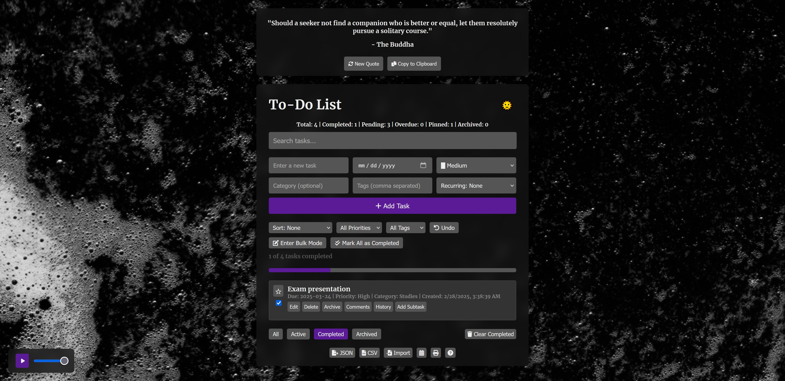
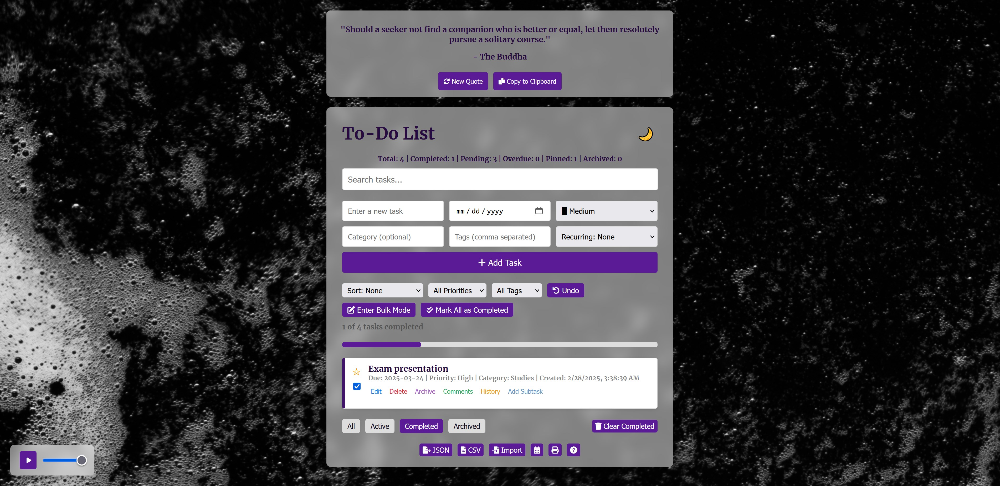

# To-Do List App 





## Overview
This is a simple To-Do List web application built with HTML, CSS, and JavaScript. The project demonstrates  CRUD operations (Create, Read, Update, Delete) and uses local storage for data persistence.

## Features
- **Add Tasks:** Create new tasks with a single click.
- **View Tasks:** See a list of your tasks.
- **Edit Tasks:** Modify existing tasks via a prompt or inline editing.
- **Delete Tasks:** Remove tasks that are no longer needed.
- **Local Storage:** Tasks persist between sessions using the browser's local storage.
- **Filter Tasks:** Filter tasks by status (all, active, completed, archived).
- **Sort Tasks:** Sort tasks by due date, priority, category, last updated, or created date.
- **Search Tasks:** Search tasks by text.
- **Bulk Mode:** Perform bulk actions like delete and mark all as completed.
- **Subtasks:** Add and manage subtasks.
- **Recurring Tasks:** Set tasks to recur daily, weekly, or monthly.
- **Task History:** View the history of changes made to tasks.
- **Comments:** Add comments to tasks.
- **Dark Mode:** Toggle between light and dark mode.
- **Calendar View:** View tasks in a calendar format.
- **Analytics Summary:** View a summary of task statistics.
- **Print Tasks:** Print the list of tasks.
- **Music Player:** Play background music while using the app.
- **Random Quotes:** Fetch and display random quotes from an API.

## Setup Instructions
1. **Clone the Repository:**
   ```bash
   git clone https://github.com/Saed-K/js-todo-list.git

2. **Navigate to the Project Directory:**
   ```bash
   cd todo-list-app

3. **Open the App:** 

Open index.html in your favorite web browser.
